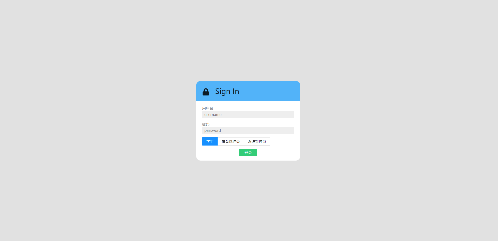
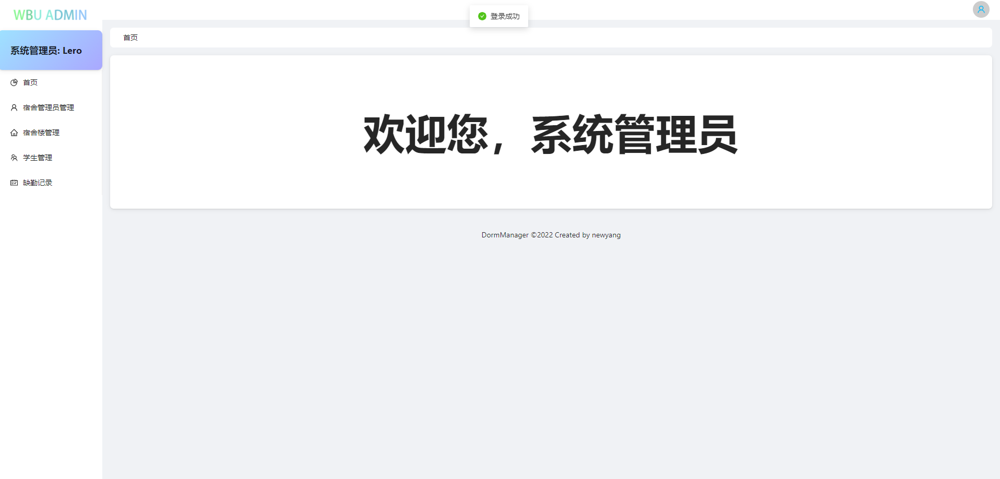
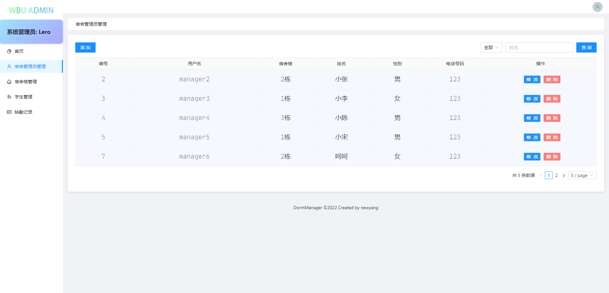
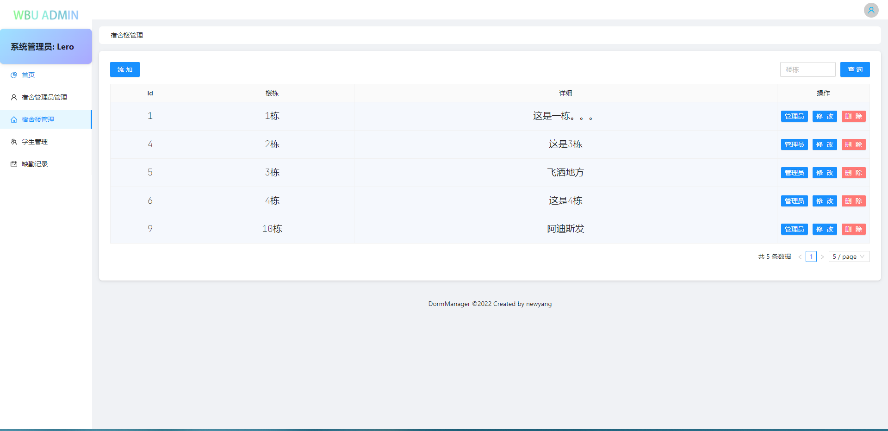
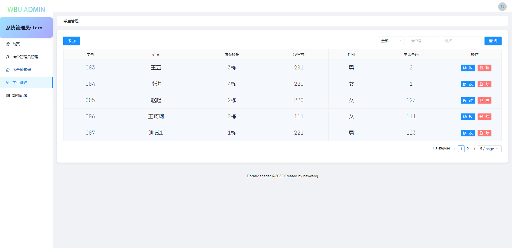
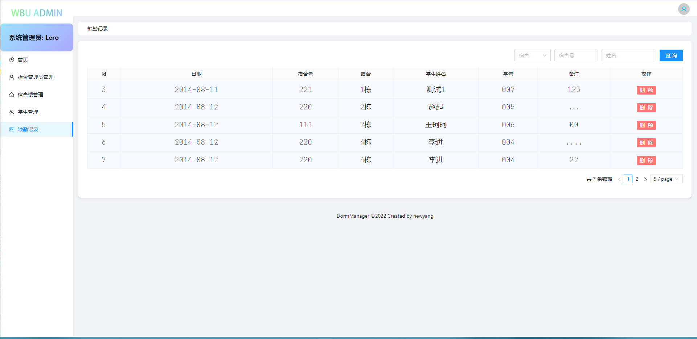
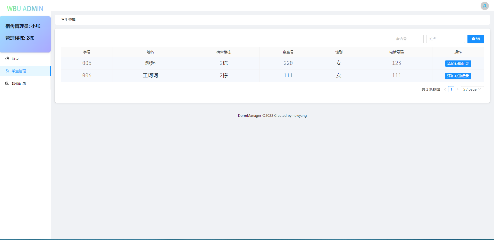
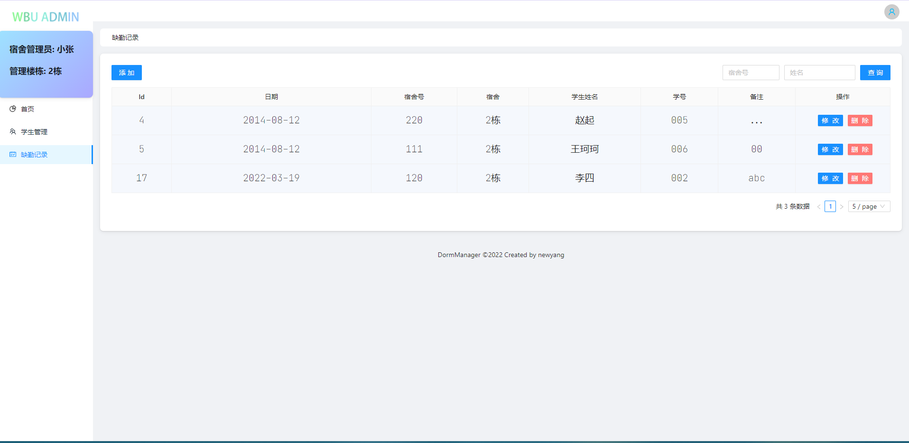
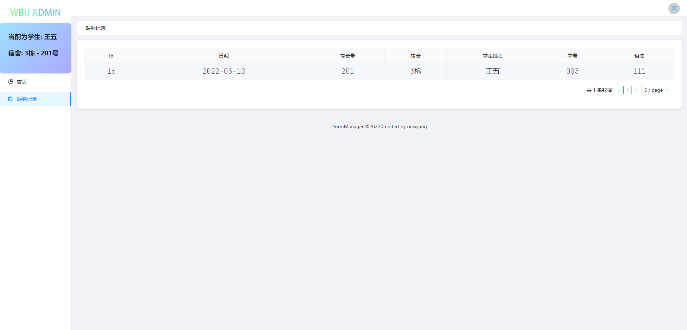

# Dorm Manage(宿舍管理系统)

​                      

## 简介

这是对 Dorm Manage 的重构

## 使用技术

后端:

> 1. Springboot
> 2. Springboot-Data-JPA
> 3. Springboot-Web
> 4. Swagger3 + knife4j
> 5. Mysql 8

前端:

> 1. Vue3
> 2. Vite2
> 3. Ant design vue 3
> 4. Typescript

## 快速上手

### 1、运行环境和所需工具

- 编译器：IntelliJ IDEA
- 项目构建工具：Maven
- 数据库：Mysql 8
- JDK版本：jdk1.8
- Nodejs版本:  nodejs 16及以上
- Nginx

### 2、初始化项目

- 将目录下 db_dorm.sql 导入到数据库中
- 进入DormManage_Backend\src\main\resources 中，编辑 application.yaml 配置文件，配置 server.port 端口和数据库相关配置
- 用 Idea 导入 DormManage_Backend 目录，使用maven进行项目构建，最后Target目录下的 jar 包即为最后准备运行Web服务程序
- 使用  `java -jar jar包名称 `来运行web服务, 然后我们可以打开http://localhost:port/doc.html 来进入 Api 管理界面，用户 root 密码 123456
- 接下来进行前端部署
- 进入`DormManage_Frontend` 目录下，编辑 `.env.production` 文件，将其中的地址改为现在 web 服务所提供的地址
- 在当前目录下使用` npm install `来进行 node_modules 安装
- 再使用` npm run build `命令来进行构建，这两个步骤可能会等待较长时间
- 最后将 dist 目录下的产物移动到 nginx 中的 html 目录下，并开启 nginx完成所有操作

## 功能模块展示

